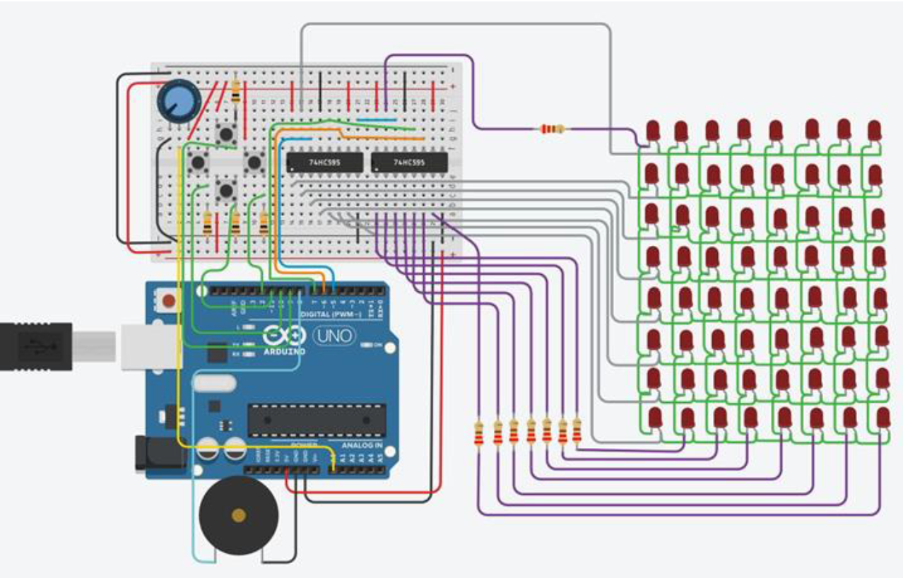

# Tetris Project Version 1

Version 1 was made for my second year design class ECE 2242 withanakin4747 and Parker Young.
We decided to make a tetris game but to reduce scope reduced the size of the screen and game shapes.
The 5 shapes we used were a 2x2 block, 1x2 bar, 2x2 diagonal, 2x2 L, and a single pixel.
The game difficluty wich determines the shape falling rate is chosen with the poteniometer before the game and the score is displayed in binary after the game is over.
The classic tetris music played over the speaker

The Schematic in TinkerCad:

